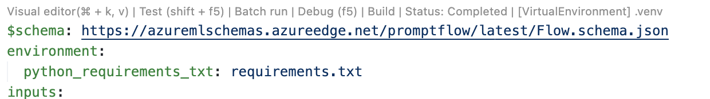
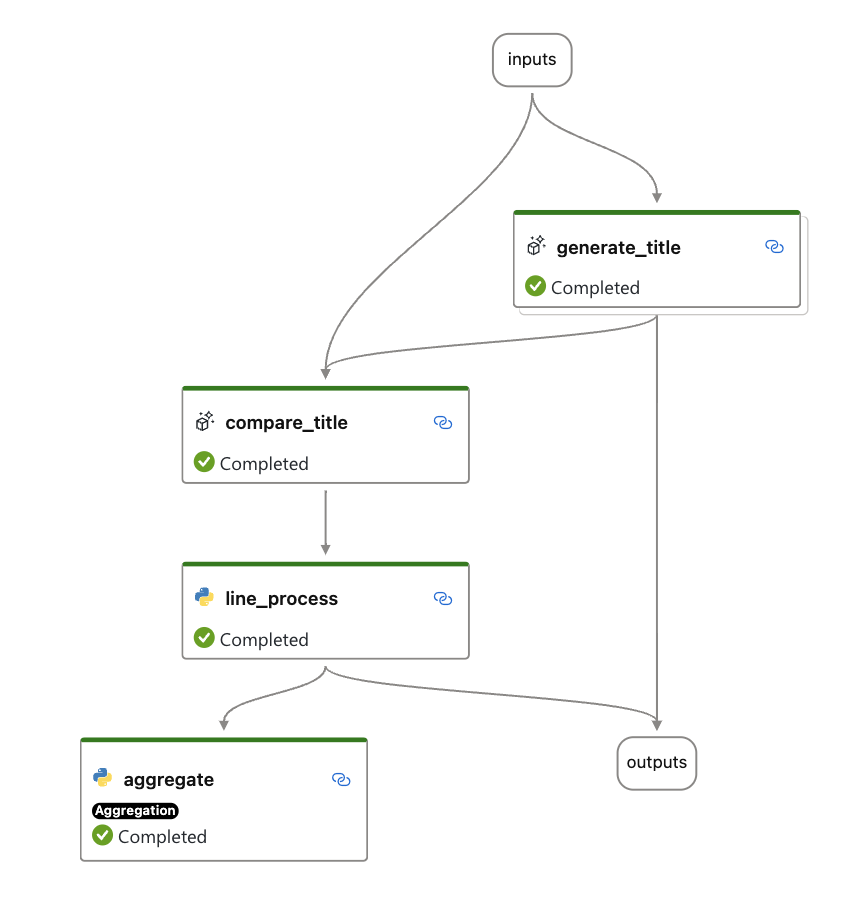
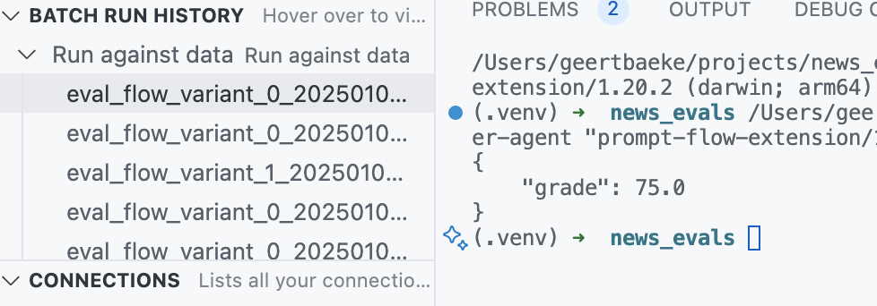
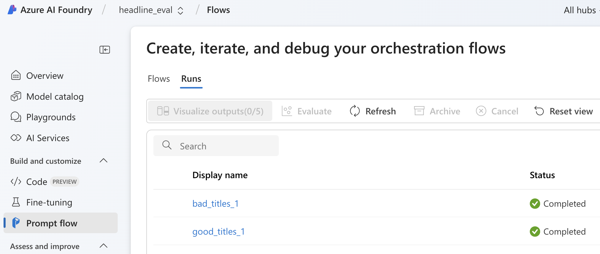
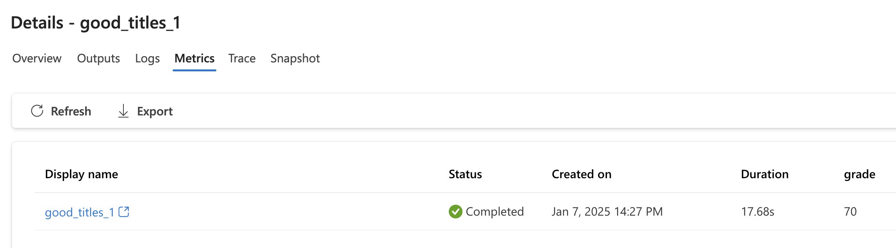
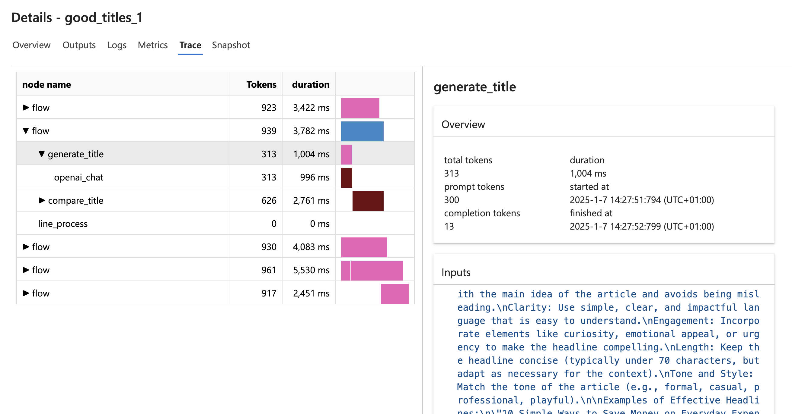
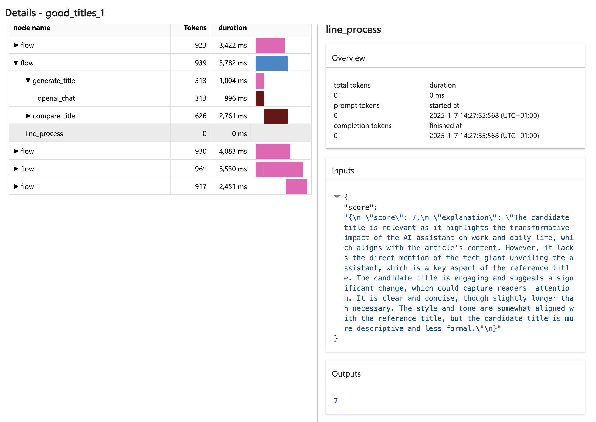
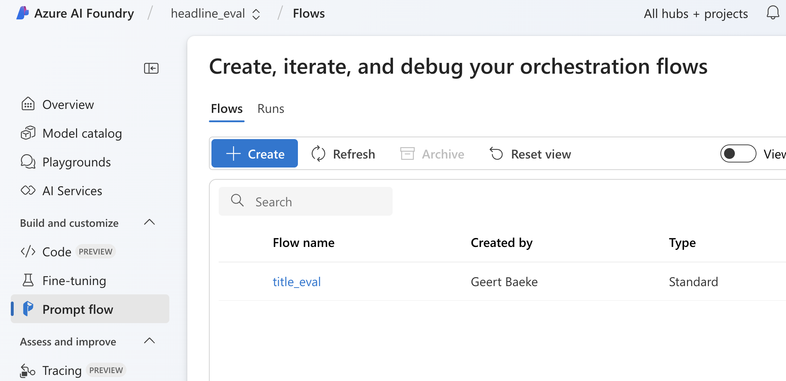
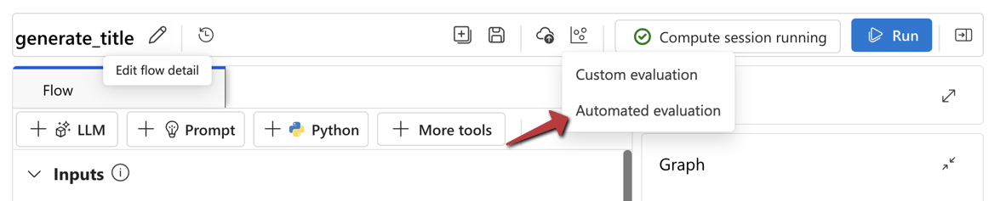
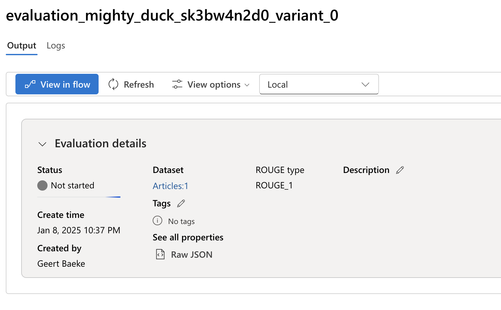

# Evaluation with Prompt Flow

## Quick start

- Clone the repo
- Create and activate a Python virtual environment
- Install the dependencies with `pip install -r eval_flow/requirements.txt`
- Install the Prompt Flow extension in VS Code
- Open `flow.dag.yaml' and check that you see the links above the YAML file:



Click Visual Editor to see the flow as depicted below.

**Note:** If you do not see the links, check that all dependencies are deployed. Check the Prompt Flow docs here: https://microsoft.github.io/promptflow/how-to-guides/installation/index.html

## Overview

With evaluation flows, you can evaluate the performance of LLMs. An evaluation flow is simply a flow that contains an evaluation component that uses Prompt Flows's **aggregate** capability. The image below contains such a flow:



The flow above has an **aggregate** node that takes in the results of line_process. If line_process returns a string, and you do a batch run of this flow with 10 inputs, the aggregate node can accept a list of strings. The Python code in the aggregate node will then be run on that list of strings. You can do whatever you want there. Here is the code from the aggregate node in the example above:

```python
from typing import List

from promptflow.core import log_metric, tool


@tool
def aggregate(scores: List[int]):
    """
    This tool aggregates the processed result of all lines and calculates a percentage score.

    :param scores: List of the output of line_process node.
    """

    # Add your aggregation logic here
    # Aggregate the results of all lines and calculate the accuracy
    avg_score = (sum(scores) / len(scores)) * 10 if scores else 0
   

    # Log metric the aggregate result
    log_metric(key="grade", value=avg_score)

    return avg_score
```

Above, the aggregate function takes in a list of integers, calculates the average, and logs it as a metric. The aggregate function then returns the average score. This means that the line_process node returns an integer.

## Flow details

The evaluation flow starts with the following inputs:

- title: the title of a news article
- content: the news article content

Next, the generate_title node runs. This is the code or prompt we would like to evaluate. The output of the generate_title node is a string, which is the generated title. Note that generate_title has two variants:

- variant_0: a prompt that generates a good title based on the content
- variant_1: a prompt that generates a bad title based on the content

When the title is generated, the compare_title node runs. It compares the generated title to the input title and generates a score between 1 to 10. It does so in a JSON object with a field called score.

The line_process node takes in the JSON as a string, extracts the score and converts it to an integer.

The aggregate_node takes in the integer and calculates a score. The score and generated title are sent to the output node.

## Batch run

If you do a batch run of this evaluation flow, you need to provide data to the batch run. The data is in articles.jsonl. Here is an example of the data:

```json
{"title": "Tech Giant Unveils Groundbreaking AI Assistant", "date": "2025-01-06", "content": "A leading tech company has announced the launch of its latest AI assistant, promising to revolutionize daily life and work efficiency. Equipped with advanced natural language processing and real-time adaptability, the assistant is designed to assist with tasks ranging from scheduling to creative writing. Analysts believe this innovation could redefine how businesses and individuals interact with technology, sparking debates over privacy and ethical AI usage."}
{"title": "Global Leaders Convene for Climate Action Summit", "date": "2025-01-06", "content": "World leaders are gathering in Geneva for the Climate Action Summit, addressing critical issues such as carbon emissions, renewable energy, and global temperature rise. The conference aims to reinforce commitments to the Paris Agreement while introducing stricter targets. Activists worldwide have staged demonstrations, urging immediate action as natural disasters intensify."}
{"title": "Breakthrough in Cancer Research Offers New Hope", "date": "2025-01-06", "content": "Researchers have developed a groundbreaking treatment for a rare type of cancer, showing a 90% success rate in clinical trials. The innovative therapy, based on gene editing, represents a major advancement in personalized medicine. Experts predict it could pave the way for treating other conditions, potentially transforming healthcare."}
{"title": "Major Sports Event Kicks Off Amid High Expectations", "date": "2025-01-06", "content": "The world's attention turns to Paris as the international sports championship begins. Over 10,000 athletes from 150 nations will compete in various disciplines over two weeks. Fans are excited about anticipated rivalries and record-breaking performances, while officials have assured top-notch facilities and security measures for participants and spectators."}
{"title": "Breakthrough Renewable Energy Project Launches", "date": "2025-01-06", "content": "A groundbreaking solar energy project has been inaugurated in the Sahara Desert. Spanning thousands of hectares, the project aims to supply clean energy to millions across Africa and Europe. Experts hail it as a step toward reducing dependence on fossil fuels, though some raise concerns about environmental impacts on local ecosystems."}
```

The idea is that these are known good titles. For each article, we want to generate a new headline and compare the generated headline to the known good headline.

When you submit the above jsonl to the batch run, the following will happen:

- for each line, run the flow with title and content as input
- generate and compare the generated title to the known good title
- in the end, send all scores to the aggregate node and emit a metric called grade

In VS Code, you can use the batch run history to retrieve the metric by right clicking the run and selecting view metrics.



Because there are variants, the batch run will ask you to select a variant. You can select either variant_0 or variant_1.

## Run the flow in Azure

By default, when you use VS Code to build and batch run the flow, everything runs on your local machine. Run history is also stored locally. It runs the flow by executing a command: `pf run create...`

Even if you build the flow locally, you can still run the flow in Azure and store the results in an AI Foundry project. Use the following command as an example:

```bash
pfazure run create -g resource_group -w ai_foundry_project --flow flow_folder --data flow/articles.jsonl \
    --stream --subscription subscription_id \
    --column-mapping title='${data.title}' content='${data.content}' \
    --variant '${generate_title.variant_1}' \
    --name name_of_run
```

Notes:

- resource_group: the name of your Azure resource group that contains the AI Foundry hub and project
- ai_foundry_project: the name of your AI Foundry project
- flow_folder: the folder on your local machine that contains the flow
- articles.jsonl: the data file
- name_of_run: the name of the run. It will show up in your AI Foundry project in Prompt Flow runs.
- variant: the variant you want to run. You can use either variant_0 or variant_1.

For example, if the run name is `good_titles_1`, you will see it in your AI Foundry project under Prompt Flow runs:



You can then click on the run and click the details icon in the upper right corner. One of the details will be the metrics:



Above, the calculated grade was 70%.

**Note:** it can take a while for the run to complete if you use **serverless compute** in your AI Foundry hub. It takes time to spin up a virtual machine that runs the evaluation flow for you. You can use **dedicated compute** to speed up the process.

If you want to see all the details of the batch run, click Trace:



This allows you to see all the details per item in your data file. For example, you can see the generated title and score and the prompts that were used to obtain them. Because line_process emits both the score and an explanation of the score, you can see both in the trace:



## Creating a flow in the cloud

If you have developed the flow locally and want to duplicate that flow in the cloud, run the following command:

```bash
pfazure flow create --flow flow_folder --set display_name=flow_display_name description="Flow Description" -g resource_group -w ai_foundry_project
```

Ensure the following:

- connections with the same name (e.g. connection to Azure OpenAI)
- upload data files in a separate step

After creating the flow, it should show in the UI:



**Note:** you can also upload your flow if you create the flow in the cloud and select the upload option in the UI.

## Generate title flow

The flow in folder `generate_title` is a simple flow that generates a title based on the content. This flow can be used in an automated evaluation. We can ask Prompt Flow to evaluate the `generate_title` based on the set of articles in `articles.jsonl`. The flow contains the following nodes:

- input: content of the article
- generate_title: generates a title based on the content
- output: the generated title

The flow can be uploaded to a project as follows:

```bash
pfazure flow create --flow generate_title --set display_name=generate_title description="Generate news headlines" -g resource_group -w ai_foundry_project
```

In Prompt Flow in AI Foundry, navigate to the flow and start a Compute session. Next, select `Automated evaluation` as shown below:



The automated evaluations only support **query and response**. In the wizard that follows:

- Basic information: provide a name for the evaluation and select a flow to evaluate (generate_title)
- Configure test data: use an existing data file (articles.jsonl) or add a new one; map the input to the flow to a field in the data set (e.g., content)
- Select metrics: select AI quality metrics that are either AI Assisted (LLM) or NLP-based; depending on the selection you will need to map your dataset fields to the evaluation input; for example **groundedness** requires context, response and query to determine the groundedness of the response.
  - metrics like F1, BLEU, ROUGE, etc. require a ground_truth field in the dataset; in the case of articles the ground_truth field would be the title and the response field would be the generated title
- Review and finish: review the configuration and start the evaluation

**Important:** for headline evaluation you might select the article content as context, the title generation prompt as query and the generated title as response. However, some of the metrics are not built for this type evaluation. For example, Coherence complains about a missing query. Fluency might complain about the lack of depth in the answer because it is just a title. Groundedness and relevance should work fine.

The evaluation will start and that will be visible in the Output:



Note that the automated evaluation can take a while.

## Using the evaluation SDK

The folder `eval_sdk` contains a very simple example to run an AI-assisted groundedness evaluator on sample data. For this sample to work, create a `.env`file in the folder like below:

```bash
AZURE_OPENAI_ENDPOINT=your_azure_openai_endpoint      # URL of your Azure OpenAI service
AZURE_OPENAI_API_KEY=your_api_key                     # API key for authentication
AZURE_OPENAI_DEPLOYMENT=your_model_deployment_name    # Name of your deployed model
AZURE_OPENAI_API_VERSION=your_api_version            # API version for Azure OpenAI e.g., 2024-10-21
AZURE_SUBSCRIPTION_ID=your_subscription_id           # Azure subscription identifier
AZURE_RESOURCE_GROUP=your_resource_group_name       # Azure resource group name
AZURE_PROJECT_NAME=your_project_name                # Name of your AI foundry project
```

Note that the three last parameters are only needed when you run cloud-based evaluators like the Groundedness Pro evaluator. I removed the Groundedness Pro evaluator from the code because it was not supported in the region of my AI Foundry project.